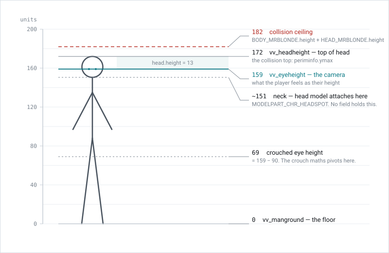
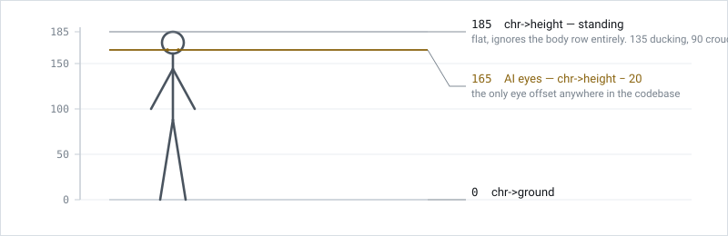

# Heights

The engine tracks a character's height in more than one place, and the fields do not mean what their names suggest at first glance. This page describes the player convention, the separate convention AI characters use, and the things elsewhere in the engine that are calibrated against Joanna's numbers.

One game unit is approximately one centimetre. The values below are Joanna's.

<picture>
  <source media="(prefers-color-scheme: dark)" srcset="heights-dark.svg">
  
</picture>

## The player fields

Three quantities live on the player struct:

* `vv_eyeheight` is the camera height above the floor. This is what the player experiences as their own height. It is 159 for Joanna.
* `vv_height` is the same quantity animated per tick, so head bob and landing dips move it around `vv_eyeheight`.
* `vv_headheight` is the top of the head, and it is the collision top. `playerUpdatePerimInfo` sets `periminfo.ymax` to `vv_manground + vv_headheight`, and `playerGetBbox` uses it the same way. It is 172 for Joanna.

`vv_eyeheight` is read straight from the body's row in `g_HeadsAndBodies`:

```c
g_Vars.currentplayer->vv_eyeheight = (s32)g_HeadsAndBodies[bodynum].height;
```

`vv_headheight` is then that value plus the *head* row's own `height` field, which is 13 for every human head in the table and 27 for every Maian one.

Note that `playerLoadDefaults` hardcodes 159 and 172 and applies whenever there is no chr body yet, which covers all of solo play. Anything that changes the convention has to change there too, or solo and multiplayer diverge.

## `height` is eye level, not the neck

The obvious reading of a body row's `height` is that it measures the body model, and therefore stops at the neck where the head model attaches. That reading is wrong.

If `height` were the neck, then the head row's `height` would have to be the head model's extent above its attach point at `MODELPART_CHR_HEADSPOT`. Measured from the models, that extent is 21.4 for Joanna, 18.7 for Mr Blonde and 34.9 for Elvis. The field is 13, 13 and 27 — constant per species rather than per model. It cannot be a measurement of any particular head.

What it is instead is the distance from the eyes to the crown for that species, and `height` therefore lands part way up the head. Across the table it sits between 41% and 52% of the way up for humans, and lower on the Maian skull, which is anatomically about right.

The code agrees. `playerGetBbox` carries the comment "ymax is the top of the head", and `bmoveFindEnteredRoomsByPos` builds its bounding box as `eyeheight` below the player position and `headheight - eyeheight` above it, which only works if those two are the eyes and the crown.

There is no separate concept of an eye offset anywhere on the player side. There are exactly three heights and no fourth quantity for the neck.

## The collision ceiling

`vv_headheight` is capped:

```c
if (g_Vars.currentplayer->vv_headheight > g_HeadsAndBodies[BODY_MRBLONDE].height + g_HeadsAndBodies[HEAD_MRBLONDE].height) {
    g_Vars.currentplayer->vv_headheight = g_HeadsAndBodies[BODY_MRBLONDE].height + g_HeadsAndBodies[HEAD_MRBLONDE].height;
}
```

This is data driven rather than a literal. Mr Blonde is the tallest body in the table, so the cap means "no player's collision volume is taller than the tallest character the levels were built around". It evaluates to 182 on NTSC 1.0 and later, and 188 on the beta ROMs where his row is 175 instead of 169.

The cap applies to the collision top only. `vv_eyeheight` is not capped for a normal player, so a body taller than Mr Blonde will place the camera correctly and only have its collision volume trimmed. The one exception is the Counter-Operative clamp immediately above it, which pulls the anti player's eye height down to 159 so that inhabiting a tall guard does not buy a sightline advantage. That clamp was added after the NTSC beta.

## What else is calibrated to 159

Several unrelated systems normalise against Joanna's eye height, so changing a character's height changes more than where the camera sits.

* **Movement speed and weapon sway.** `bwalk0f0c69b8` computes `(vv_eyeheight - 159) / 353.33 + 1` and multiplies both the forward and sideways speed and the sway target by it. Taller characters already move faster and sway more.
* **Crouch depth.** `bwalkUpdateCrouchOffsetReal` branches on `69.0f`, which is `159 - 90`, Joanna's squatting eye height. Characters shorter than 159 have their crouch rescaled so that the crouched eye lands on 69; characters at or above it scale proportionally. Moving a character across 159 moves them across that branch.
* **Head bob.** The landing and bob term in `bwalkUpdateVertical` carries a literal `0.0062893079593778f`, which is exactly `1/159`.
* **Turn speed.** `bwalkUpdateTheta` scales turn rate by `159 / vv_eyeheight` on N64. The PC port hardcodes a multiplier of 1, so turn speed does not vary with height there.

Of these, only the Counter-Operative clamp genuinely means Joanna. The rest mean "the engine's reference human" and should not be moved with her.

## AI characters use a different convention

<picture>
  <source media="(prefers-color-scheme: dark)" srcset="heights-ai-dark.svg">
  
</picture>

AI characters do not use their body row for height at all. `chr->height` is set to a flat 185 standing, and dropped to 135 when ducking and 90 when crouching, regardless of which body the chr is wearing. `botGuessCrouchPos` reads those same thresholds back to work out what stance a bot is in.

AI sight lines originate at `chr->ground + chr->height - 20`, so every AI in the game looks out from 165 above the floor whether it is Elvis or Mr Blonde. That `- 20` is the only eye offset of any kind in the codebase.

The practical consequence is that a chr spawned on an unusually tall or short body collides and sees exactly like any other chr. Body height only reaches AI behaviour through `botCalculateMaxSpeed`.

## Setting height per body

Both `height` and `scale` are per-row fields on `g_HeadsAndBodies` and both are parseable from a mod's `modconfig.txt`, so per-character proportions need no engine change.

The two are independent. `height` drives the camera and the collision volume; `scale` is passed to `modelSetScale` and drives the rendered size of the model. Setting one without the other produces a character whose eyes are in one place and whose body is drawn at another size. Within a single body model the two are proportional, so a variant of an existing body wanting to be a different height should scale both by the same ratio; across different models there is no such relationship, because each raw model has its own intrinsic size — the ratio of `height` to `scale` ranges from 153 for Mr Blonde to 185 for Elvis.

The third field is `canvaryheight`. When set, `body0f02ce8c` multiplies the model scale by a random factor in the range 0.95 to 1.05 at spawn, which is what gives crowds of guards a little variety. It is set on the generic guard bodies and clear on all the named characters. It affects the model scale only and never `height`, so a body with it set renders at a slightly different size each spawn while its camera and collision volume stay fixed.
